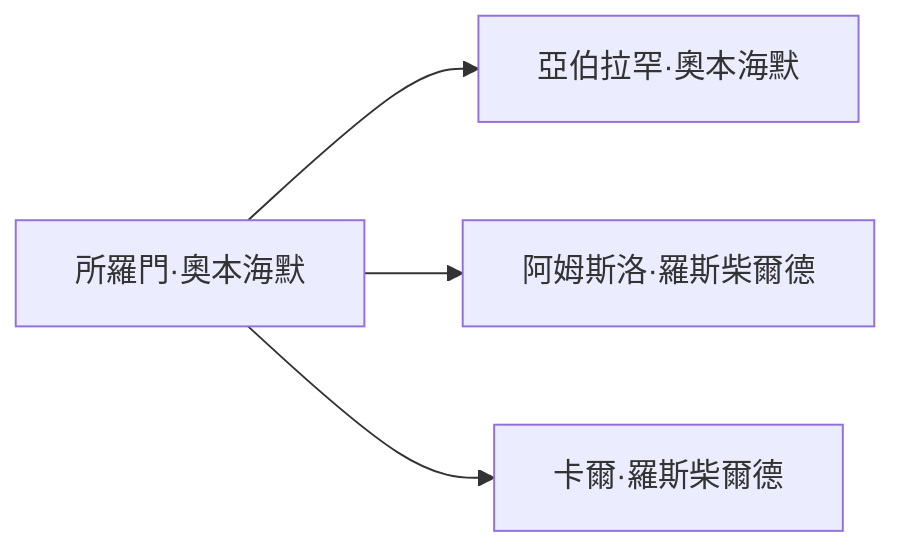

# 所羅門·奧本海默

## 基本資訊
- **中文名**：所羅門·奧本海默
- **英文名**：Solomon Oppenheimer
- **角色定位**：19 世紀奧地利金融與政治人物，奧本海默家族的核心之一。

## 書中描述
- 為 **所羅門·奧本海默**，在《金權天下》中被描寫為掌管奧地利金庫的要員，與 **阿姆斯洛·羅斯柴爾德**、**卡爾·羅斯柴爾德** 緊密合作，維繫奧本海默家族與羅斯柴爾德家族的金融聯盟。
- 其子 **亞伯拉罕·奧本海默**（Abraham Oppenheimer）繼承其財務與政治影響力，與羅斯柴爾德家族保持密切聯繫。

## 人物關係圖（Mermaid）

> **備註**：本書中的奧本海默家族（所羅門、亞伯拉罕等）與 20 世紀的核物理學家 **J. Robert Oppenheimer**（研發原子彈者）同姓但無已知血緣關係。兩者分別屬於金融貴族與科學家兩個完全不同的歷史脈絡，僅因姓氏相同而易產生混淆，實際上並未在家譜或歷史記錄中相連。
