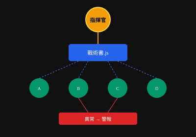

# 蜂群戰術 | 戰地筆記
> **0528 | 緊急記錄 | 實戰中**

---

## 狀況

剛完成首次蜂群部署。記下來，免得忘。

---

## 核心發現

**Claude 能寫戰術書。戰術書能指揮子蜂群。子蜂群能並行作戰。**

這是軍團級能力。



---

## 入口

找 **{核心速查}** → 輸入：

```
ultraWork [任務]
```

例：
```
ultraWork 多股票實時監控蜂群
限制 100萬 token
```

Claude 會生成 .js 戰術書。

---

## 流程（記牢）

```
1. ultraWork 下達任務
2. 設 token 上限（彈藥管控）
3. Claude 生成戰術書
4. 精進腳本（這步很重要，別跳過）
5. 「請以 xxx.js 執行」
```

---

## 今天的實戰：股票監控蜂群

**任務**：5-20 檔股票並行監控

**為什麼需要**：
- 看盤機掛了 → 蜂群頂上
- 出差睡覺 → 蜂群不睡
- 毫秒級偵測 → 人眼追不上

**結果**：成功。細節待補。

---

## 作戰循環


**部署 → 實戰 → 迭代 → 循環**

---

## 心得（快速記）

- 戰術書是資產，不是一次性
- 版本控制它，Git 管起來
- 分享給戰友，省重複造輪
- Token 要設限，不然燒光

---

## 待辦

- [ ] 補完監控蜂群細節
- [ ] 整理腳本模板
- [ ] 記錄錯誤與修復

---

*0528 戰地記錄完畢*
