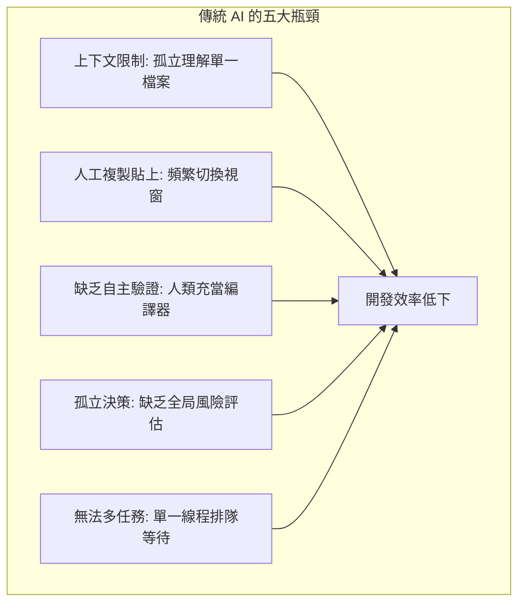
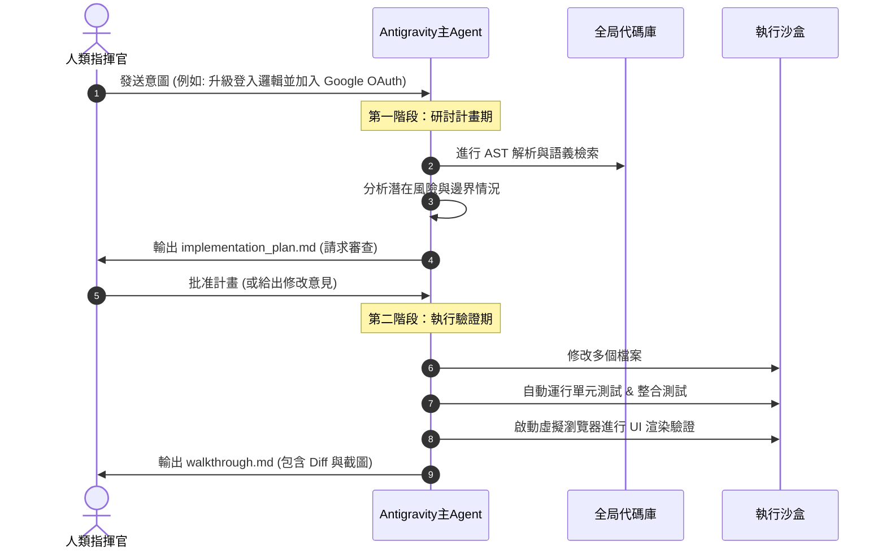
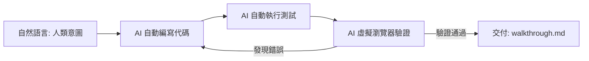
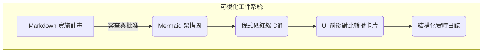

# Agent-First 基礎 —— 為什麼 Antigravity 2.0 會改變一切？

> **副駕駛時代已死。自動駕駛時代已至。**
> 
> 在這篇文章中，我們不談虛無縹緲的 AI 願景，也不談沒有靈魂的代碼補全。
> 
> 我們將剖析 **Antigravity 2.0** 的底層架構，向你展示為什麼「雙階段計畫範式」、「多智能體協同調度」、「可視化工件系統」與「瀏覽器端自動化驗證」這四大核心，將徹底終結 Copilot 時代，開啟屬於 **Agent-First** 的架構革命。

---

## 📋 本篇導讀與核心定位

當你在 2026 年的今天談論 AI 輔助開發，如果你腦中浮現的還是「在編輯器裡敲下 Tab 鍵讓 AI 補全一行代碼」，或者是「複製貼上一段報錯給 ChatGPT 讓它幫你 debug」，那麼你已經落後了整整一個時代。

這不是危言聳聽。傳統 AI 助手（如 GitHub Copilot、ChatGPT）本質上是**被動式的「副駕駛」（Copilot）**。它們有出色的代碼生成能力，但缺乏決定性的**「代理能力」（Agency）**。

Antigravity 2.0 則是為**「自動駕駛」（Auto-pilot / Agent-First）**而生的執行引擎。它代表了一種全新的開發範式：開發者不再親自動手修改每一行代碼、手動執行每一次編譯與測試，而是轉變為**「策略決策者」與「意圖指揮官」**。

讀完本篇後，你將徹底理解：
1. **Antigravity 2.0 的四大核心架構**是如何無縫協作的。
2. 為什麼**「雙階段計畫範式」**是工程信任的基石。
3. 如何將 Software 3.0 的**「意圖驅動」**理念，落地為可自動化執行的代碼與閉環驗證。

---

## 🛑 開篇：副駕駛時代的終結

要理解 Antigravity 2.0 為什麼具有顛覆性，我們必須先直面傳統 AI 助手在實際工程開發中遇到的 **五大致命瓶頸**：



### 1. 上下文限制 (Context Window Bottleneck)
傳統 AI 助手通常只能讀取你當前打開的檔案，或者最多透過啟發式算法讀取少數相關檔案。當你需要重構一個跨越十幾個模組的業務邏輯時，AI 會因為看不到全局的架構依存關係，而給出前後矛盾、甚至導致系統崩潰的建議。

### 2. 人工複製貼上 (Manual Copy-Paste Hell)
「AI 生成代碼 $\rightarrow$ 人類複製 $\rightarrow$ 切換編輯器貼上 $\rightarrow$ 發現報錯 $\rightarrow$ 複製報錯貼回 AI $\rightarrow$ 重新生成 $\rightarrow$ 再複製貼上」。這個循環不僅低效，更是對人類腦力的極大損耗。人類退化成了 AI 與編輯器之間的高級傳輸線。

### 3. 缺乏自主驗證 (Lack of Self-Verification)
傳統 AI 寫完代碼後就拍拍屁股走人。它不知道代碼能不能編譯通過，不知道會不會破壞既有的單元測試，更不知道在瀏覽器真實渲染出來時排版會不會跑掉。最終，人類必須充當 AI 的「人肉測試機」。

### 4. 孤立決策 (Isolated Decision-Making)
傳統 AI 看到什麼就改什麼，缺乏「先規劃、後動手」的意識。它不會在修改前評估對其他模組的潛在風險，更不會預先警告開發者可能會引入的破壞性變更（Breaking Changes）。

### 5. 無法多任務並行 (Lack of Multi-Tasking Swarms)
在面對大型重構時，傳統 AI 只能單線程地一個問題接一個問題處理，無法同時派出一支「AI 專家軍隊」分別去優化 API、重構資料庫和更新文檔。

---

### 💡 關鍵洞察：AI 不是工具，而是協同者

在傳統觀念中，我們把 AI 當成一個「更好用的鍵盤快捷鍵」。但 Antigravity 2.0 的設計哲學認為：**AI 應該是一個具備完整主動性的「虛擬協同者」**。

這就像駕駛汽車的轉變：
* **Copilot（副駕駛）**：你開車，它在旁邊看地圖，偶爾幫你拉一下方向盤。你累得要死，它還可能指錯路。
* **Agent-First（自動駕駛）**：你設定目的地，它規劃路線、握好方向盤、踩油門、避開障礙物，並實時向你報告行車狀態。你只需要在關鍵分岔路口做決定。

| 維度 | Copilot 模式（副駕駛） | Agent-First 模式（自動駕駛） |
| :--- | :--- | :--- |
| **主導權** | 人類執行，AI 輔助（被動） | AI 執行，人類審查（主動） |
| **交互單位** | 代碼行、函數補全（Tab） | 意圖（Intent）、任務目標（Goal） |
| **執行範疇** | 單一檔案、單一程式碼區塊 | 全局代碼庫、多檔案連動修改、終端指令執行 |
| **品質保障** | 人肉編譯、手動運行測試與除錯 | 閉環自動化驗證、瀏覽器模擬真實操作 |

---

## 🏗️ 第一層：雙階段計畫範式 (Dual-Phase Plan Paradigm)

在工程實踐中，我們最怕 AI「不假思索地亂改代碼」。Antigravity 2.0 為了解決這個問題，引入了核心發明：**雙階段計畫範式**。

這套範式將所有變更強制劃分為兩個完全解耦的階段：**研討計畫期（Research & Plan）** 與 **執行驗證期（Execute & Verify）**。



---

### 🔍 第一階段：研討計畫期（Research & Plan）

為什麼 AI 要先「深入探索」而不是「立即動手」？

在真實代碼庫中，任何看似簡單的修改都可能牽一髮而動全身。直接動手改代碼，是新手程序員最容易犯的錯誤，也是傳統 AI 助手導致崩潰的主因。Antigravity 2.0 規定，在動任何一行代碼之前，必須先經過嚴格的研討。

這一階段有三個核心動作：

#### 1. AST 解析（Abstract Syntax Tree）
AI 會利用靜態分析工具解析項目的抽象語法樹，機械化地理解代碼結構。它能精確知道哪些類別繼承了這個接口，哪些函數調用了這個 API，從而建立起一張網狀的「代碼關係圖」。

#### 2. 語義提取
除了機械式的調用關係，AI 還會透過深度學習模型，研讀代碼注釋、README、既有提交記錄，理解底層的業務邏輯與架構約定（例如：這個項目採用了 Clean Architecture 還是 MVC？它的錯誤處理機制是什麼？）。

#### 3. 計畫生成
最終，AI 會將探索結果整理成一份詳盡的 `implementation_plan.md`（實施計畫書）。這份計畫書會明確列出：
* **目標描述**：AI 理解的任務終點。
* **修改範圍**：哪些檔案需要 [NEW] 創建、[MODIFY] 修改、[DELETE] 刪除。
* **潛在風險**：是否會引入破壞性 API 變更？是否可能影響資料庫遷移？
* **驗證計畫**：如何證明修改是正確的？（預計運行哪些測試指令）。

> [!IMPORTANT]
> **開發者在這裡的角色是「審查者」（Reviewer），而不是「執行者」（Executor）。**
> 你不需要寫代碼，你只需要看著這份計畫書，評估 AI 的思路是否與你一致。你可以直接在計畫書上標註意見，讓 AI 修正它的路線，直到你點擊「批准」。

#### 🔗 與 Software 3.0 的連接：
Software 3.0 的核心理念是**「意圖驅動編程」（Intent-Driven Programming）**。意圖通常是高維度的、模糊的自然語言（例如：「我想讓推薦演算法的載入速度變快一倍」）。

計畫階段，正是將這種**「人類的高維意圖」**轉化為**「機器的低維執行步驟」**的橋樑。AI 負責把你的願景翻譯成無懈可擊的工程步驟。

---

### ⚙️ 第二階段：執行驗證期（Execute & Verify）

一旦計畫獲得人類批准，系統就會進入完全自動化的執行與驗證階段。

為什麼這個階段必須完全自動化，拒絕人類手動介入？
因為人類在執行機械化任務（修改 15 個檔案中的接口名稱、重複運行 8 次測試命令、逐頁檢查排版）時是極其低效且容易出錯的。AI 在這方面擁有絕對的速度與精確度優勢。

這一階段的四個核心動作：

1. **檔案修改**：AI 在沙盒環境中，直接對代碼檔案進行精確修改。它會自覺遵守代碼風格規範（Eslint, Prettier 等），保證生成的代碼如同資深工程師親手編寫。
2. **測試運行**：AI 會在終端中自動執行相關的單元測試與集成測試，捕捉任何因修改而引入的 regression（回歸錯誤）。如果測試失敗，它會讀取錯誤日誌，**自動進行自我修復**，直到所有測試全數通過。
3. **瀏覽器驗證**：對於涉及前端 UI 的修改，AI 會啟動本地開發伺服器，調用 headless 瀏覽器自動導航到對應頁面，模擬用戶的點擊與輸入行為，確保頁面沒有崩潰。
4. **結果報告**：當一切就緒，AI 會生成一份 `walkthrough.md`（變更導覽書）。這份報告是供你審查最終成果的唯一窗口。

#### 🛡️ 工件系統（Artifacts）的威力
在 `walkthrough.md` 中，你不會看到一堆雜亂無章的代碼輸出，而是整理得極其精美的**「可視化工件」**：
* **自動排版的 Code Diff**：用清晰的紅綠色對比展示哪些代碼被修改了，且僅顯示受影響的上下文，不干擾視線。
* **Mermaid 架構圖**：如果修改涉及系統架構或流程的改變，AI 會自動生成互動式的 Mermaid 流程圖，讓你一眼看懂數據流向的改變。
* **前後對比卡片 (UI Carousel)**：在修改前端介面時，AI 會自動截取修改前與修改後的介面圖片，以輪播卡片的形式呈現，讓你以像素級的精確度審查 UI 變更。



這就是 Software 3.0 的完整閉環：**意圖 $\rightarrow$ 代碼 $\rightarrow$ 自動驗證 $\rightarrow$ 可視化交付**。整個循環在沙盒中自主運轉，無需人類手動複製貼上一行代碼。

---

## 🐝 第二層：多智能體協同調度 (Multi-Agent Swarm Orchestration)

當任務的複雜度上升到一定程度，單一的 AI Agent 就會遇到天花板。

為什麼單個 Agent 不夠用？
* **視角單一**：一個 Agent 在同一時間只能扮演一種角色。如果它既要考慮全局架構，又要寫具體代碼，還要寫單元測試，它的注意力和上下文就會被過度稀釋。
* **Token 爆炸**：把所有檔案、日誌和推理過程塞進同一個 Prompt 裡，會迅速逼近大模型的 Context 限制，導致推理能力急速下降。
* **串行阻擋**：單個 Agent 必須做完 A 才能做 B。但在實際開發中，後端 API 的編寫與前端 UI 的適配、資料庫的遷移本應是並行進行的。

### 📊 Antigravity 2.0 的虛擬專家軍團

Antigravity 2.0 採用了**「蜂群戰術」**。當接收到一個複雜意圖時，主 Agent 會像一位將軍一樣，將任務拆解，並動態定義並派遣多個專業的子 Agent（Subagents）：

```
                       [ 主 Agent (指揮官) ]
                                |
        +-----------------------+-----------------------+
        |                       |                       |
[ 研究專家 Agent ]       [ 代碼執行者 Agent ]     [ 測試驗證者 Agent ]
  (檢索代碼/搜尋Web)      (沙盒重構/檔案讀寫)      (運行測試/模擬瀏覽器)
```

1. **研究專家 (Researcher)**：配備唯讀工具。專門負責在後台大範圍檢索代碼庫、查閱外部最新官方文檔、搜尋 Web 資源。它不修改任何檔案，只為其他 Agent 提供最強大的情報支持。
2. **代碼執行者 (Executor)**：配備完整的寫檔與指令執行權限。它接收研究專家的報告，在隔離的沙盒分支中進行高強度的代碼編寫與架構重構。
3. **測試驗證者 (Verifier)**：專注於品質把關。它負責自動化測試的編寫、邊界情況的構造，並驅動虛擬瀏覽器去挑剔代碼執行者的產出。
4. **內容生成者 (Generator)**：負責非技術性事務，例如生成高質量的 API 文檔、變更日誌（Changelog），或是為發佈會起草技術部落格草稿。

### 🔄 調度策略與衝突解決

這群虛擬專家是如何合作的？
* **並行執行（不阻擋）**：當代碼執行者在修改 `UserModule` 時，測試驗證者可以同時在編寫 `UserModule` 的測試案例，研究專家則在檢索即將要對接的第三方 OAuth 提供商的最新文檔。
* **結果合併（統一視圖）**：所有子 Agent 的產出最終會匯總到主 Agent。主 Agent 會將它們的成果合併，排除重複或衝突的部分，提煉出給人類看的單一報告。
* **衝突解決（自動化決策）**：如果代碼執行者的修改導致了測試驗證者的測試失敗，它們會在主 Agent 的協調下，在沙盒中直接進行對話與調解，直到找出最優解。

這正是 **Agent 蜂群系列** 理念在開發場景下的完美落地。每個 Agent 都是極度聚焦的「專才」，它們彼此獨立，但透過嚴密的通信機制達成高度默契的協同。

---

## 👁️ 第三層：可視化工件系統 (Visual Artifact System)

在 AI 自動化時代，有一個常被忽視的工程痛點：**「黑盒焦慮」**。

當你把代碼庫交給一個實力強大但「看不見摸不著」的 AI 去修改時，你心裡是踏實的還是懸著的？如果它在後台悄悄改了 50 個檔案，然後告訴你「全部搞定了」，你敢直接部署上線嗎？

> [!TIP]
> **在開發流程中，「看得清」（Transparency）往往比「執行正確」（Correctness）更重要。**
> 因為信任是基於理解建立的，而理解來自於可視化。在 Antigravity 2.0 中，可視化就是權力——它讓人類重新掌握對系統的絕對掌控權。

Antigravity 2.0 拋棄了傳統 AI 助手只能在側邊欄進行對話的限制，設計了完整的**可視化工件系統**。



### 📦 核心工件類型與設計哲學

* **Markdown 報告**：人類可讀的、結構化的計畫（`implementation_plan.md`）和結果（`walkthrough.md`），拒絕一切口水話，只用事實和清單說話。
* **Mermaid 圖表**：將複雜的類別關係、資料庫 schema 變更、或者是多智能體協同流向，自動繪製成直觀的 Mermaid 架構圖。
* **Code Diff 區塊**：比 Git Diff 更友好的視覺排版，精確標注修改的行號與邏輯變更，支持一鍵跳轉到編輯器對應位置。
* **前後對比卡片 (Before/After Carousels)**：將 UI 的視覺變更以最直觀的滑塊或卡片形式展示，人類一眼就能看出按鈕有沒有對齊、字體有沒有跑版。
* **實時日誌視圖**：將終端機枯燥的輸出（例如 Webpack 編譯日誌、Jest 測試日誌）進行結構化過濾，只把關鍵報錯或成功指標高亮呈現。

這套系統的設計哲學是：**一個統一的信息儀表板 (Single Pane of Glass)**。
開發者不需要在終端、瀏覽器、編輯器和 Git 工具之間來回登入和切換。Antigravity 2.0 把所有你需要用來做決策的信息，用最優美的視覺排版呈現在同一個工件文件中。你只需審查、核准、看著它執行，流程清爽無比。

---

## 🌐 第四層：瀏覽器端自動化驗證 (Browser-Based Auto-Verification)

後端代碼編譯通過、單元測試 100% 綠燈，這是否意味著用戶在打開網頁時一切正常？

答案是：**完全不一定**。

前端 UI 邏輯的複雜度在今天早已超越了後端。一個簡單的 CSS 樣式微調，可能會導致在 iPhone Safari 上按鈕被遮擋；一個 React 狀態更新的順序錯誤，可能會讓用戶在點擊「提交」時網頁毫無反應。
這些問題，傳統的後端單元測試根本無能為力。如果依靠開發者每次修改後都手動打開瀏覽器、輸入測試帳號、點擊五次去驗證——那麼「自動化」就只是個半吊子。

### 🔄 虛擬瀏覽器的閉環驗證流程

Antigravity 2.0 內建了**瀏覽器端自動化驗證**機制，將前端驗證納入無人介入的閉環中：

```
                       [ 代碼修改完成 ]
                              |
                     [ 啟動本地開發伺服器 ]
                              |
               [ 驅動 Headless 瀏覽器 (Playwright) ]
                              |
              [ 模擬真實用戶操作 (點擊/填表/導航) ]
                              |
                     [ 進行像素級截圖與錄影 ]
                              |
        +---------------------+---------------------+
        |                                           |
 [ 視覺大模型自我驗證 ]                      [ 輸出對比圖與影片 ]
 (檢查排版錯亂/JS錯誤/響應式)                  (寫入 walkthrough.md)
```

1. **自動啟動伺服器**：當 AI 修改完代碼後，它會自動在後台運行 `npm run dev` 或 `yarn start`，監聽本地端口。
2. **模擬用戶操作**：調用內置的 Playwright 虛擬瀏覽器，自動打開 `localhost:3000`，輸入測試資料、點擊登入、跳轉到目標頁面，模擬最真實的用戶旅程（User Journey）。
3. **截圖與錄影**：在關鍵步驟自動截圖，並在整個操作過程中錄製影片。
4. **視覺自我驗證**：AI 會把截圖送入視覺語言模型，自我發問：「按鈕有沒有重疊？」、「文字有沒有超出邊界？」、「網頁控制台（Console）有沒有拋出未捕獲的異常？」。

### 🛡️ 這解決了開發者的哪些痛點？

* **「後端完美，前端爆掉」的慘劇**：再也不會因為修改了一個 API 欄位名稱，導致前端渲染出現 NaN 或是空白頁。
* **響應式設計（Responsive Design）在特定尺寸破裂**：AI 可以命令虛擬瀏覽器切換到 `iPhone 15 Pro`、`iPad Air` 和 `1920x1080` 的解析度，分別截圖並進行視覺比對，自動檢測佈局是否損壞。
* **繁瑣的跨瀏覽器相容性測試**：自動在 Chromium、Firefox 和 WebKit 內核下運行相同的操作路徑，確保跨平台表現一致。

在 Software 3.0 的視角下：**UI 不僅僅是給人看的，它也是代碼的一部分。因此，UI 的驗證也必須完全自動化。**
人類寶貴的時間，應該用來做戰略上的「功能決策」，而不是在瀏覽器裡一遍又一遍地刷新頁面、手動輸入測試密碼。

---

## ⚔️ 第五層：Antigravity 2.0 vs 傳統 AI 助手的決定性差異

為了讓你更直觀地感受這場變革的烈度，我們將 Antigravity 2.0 與以 GitHub Copilot 為代表的傳統 AI 助手進行了全方位的對比：

| 比較維度 | 傳統 AI 助手 (如 Copilot / ChatGPT) | Antigravity 2.0 (Agent-First 執行引擎) |
| :--- | :--- | :--- |
| **交互與運作模式** | **被動式問答**<br>必須由人類引導，一次只回答一個問題或補全一行代碼。 | **主動式代理**<br>接收高維意圖，自主研讀代碼、提案、規劃並執行。 |
| **上下文邊界** | **單一檔案或有限視窗**<br>缺乏對項目全局架構關係與依賴網絡的理解。 | **全局代碼庫 + 即時 Web 檢索**<br>無縫理解百萬行級別項目，並能即時查閱最新文檔。 |
| **系統執行權限** | **僅能生成代碼文字**<br>無法直接修改檔案或運行指令，依賴人類複製貼上。 | **自主讀寫 + 指令執行**<br>在安全沙盒中自主修改多個檔案、編譯並運行終端命令。 |
| **品質驗證機制** | **無自我驗證**<br>寫完代碼即結束，編譯報錯與邏輯漏洞完全由開發者手動排除。 | **閉環自動驗證**<br>自動運行單元測試，並驅動虛擬瀏覽器模擬用戶操作進行視覺檢查。 |
| **多任務協作** | **單一對話線路**<br>無法並行處理任務，遇到複雜重構時推理速度急劇下降。 | **多 Agent 並行調度**<br>調度由「研究、執行、測試」組成的虛擬專家蜂群並行作戰。 |
| **交付與可視化** | **對話框代碼塊**<br>開發者必須逐行看代碼，自行拼湊出系統變更的全局圖像。 | **可視化工件系統**<br>交付精美的實施計畫書、Code Diff、Mermaid 架構圖與 UI 對比。 |

### 🚀 為什麼這些差異會徹底改變遊戲規則？

* **時間成本的驟降**：傳統模式下，完成一個跨越前端、後端、資料庫的重構任務，開發者需要花費數小時進行編寫、編譯、手動測試與除錯。在 Antigravity 2.0 下，這個過程縮短到**分鐘級**。你只需要看計畫、批准、等兩分鐘看 walkthrough 報告。
* **信任度的飛躍**：面對傳統 AI 給出的代碼，開發者總是抱著「懷疑」的心態去仔細閱讀每一行，生怕有隱藏的 bug。而 Antigravity 2.0 帶著「所有測試已通過、瀏覽器渲染無異常、Diff 報告清晰」的**閉環驗證結果**來向你交付，讓懷疑變為踏實的「信心」。
* **複雜度瓶頸的突破**：過去，一個人能管理的代碼庫規模是受人類大腦工作記憶限制的。一旦系統太大，重構的代碼債就讓人「害怕」動手。現在，在虛擬專家軍團的協助下，複雜度不再是障礙，而是發揮創造力的畫布。

---

## 🏁 結尾：你的下一個 24 小時

現在，你已經理解了 Antigravity 2.0 的四大核心層次，也看到了它與傳統 AI 助手的鴻溝。

理論已經完整，架構已經清晰。現在剩下的唯一問題是：**你打算怎麼做？**

這不是一場讓你躺在沙發上觀看的科技秀，這是一場需要你立即披掛上陣的戰役。我們為你整理了在接下來 24 小時內可以立即執行的**「指揮官行動指令」**：

```markdown
- [ ] 1. **重新審視你的代碼庫**：選出一個你目前正在開發、或是想要重構的項目。
- [ ] 2. **定義你的第一個「大膽意圖」**：不要給 AI 寫「幫我寫個 helper 函數」這種小家子氣的任務。寫下一個具體的、有挑戰性的目標（例如：「把這個專案的所有 API 調用加上自動重試機制，並在 UI 上顯示重試狀態」）。
- [ ] 3. **提交給 Antigravity 2.0**：啟動引擎，輸入你的意圖，冷靜地看著它在背景開始 AST 解析與語義探索。
- [ ] 4. **深度審查 implementation_plan.md**：看著它為你整理出的修改檔案清單與潛在風險。在這個階段，體驗你作為一個「架構評審者」而非「打字員」的新身份。
- [ ] 5. **核准並享受閉環驗證**：點擊批准，讓多智能體蜂群在沙盒中並行運作。看著測試一個接一個變綠，最後審閱 walkthrough.md 中的 UI 對比圖。
```

> **預告**
>
> 在下一篇文章《多智能體戰術 —— 如何用蜂群設計實現不可能》中，我們將深入剖析 Antigravity 2.0 的調度細節。我們將以一個真實的「個人時尚助理」項目為案例，向你演示「扇出-扇入（Fan-Out Fan-In）」、「流水線（Pipeline）」以及「樹形決策（Tree Search）」這三大模式在複雜工程中的實戰應用。
>
> 但在讀下一篇之前，先去動手。
> 
> **因為自動駕駛的時代，從不等待還在看說明書的人。**

---

*第一篇完 · 寫於 2026 年 5 月 22 日*
*Agent-First 革命已至，踩下油門，即刻出發。*

---

👁️ **在 Substack 上追蹤 Antigravity 2.0 完整連載**
🚀 **立即在本地配置你的第一個 Antigravity 工作區**
⚔️ **加入自動駕駛時代的 AI 指揮官陣營**
