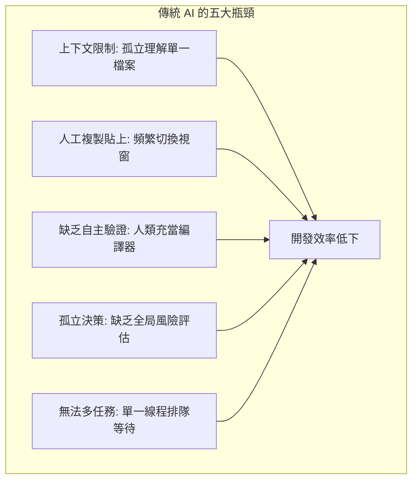
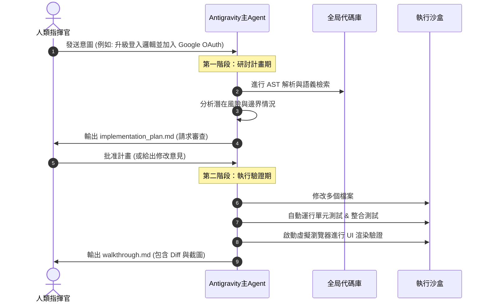
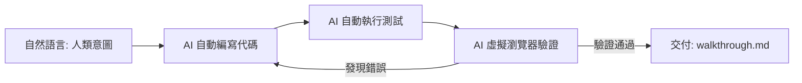

# Agent-First 基礎（上篇）—— 指揮官的思想轉變

> **副駕駛時代已死。自動駕駛時代已至。**
>
> 在這篇文章中，我們不談虛無縹緲的 AI 願景，也不談沒有靈魂的代碼補全。
>
> 我們將剖析 **Antigravity 2.0** 的底層架構，向你展示為什麼「雙階段計畫範式」與「多智能體協同調度」這兩大核心，將徹底終結 Copilot 時代，開啟屬於 **Agent-First** 的架構革命。

---

## 📋 本篇導讀與核心定位

當你在 2026 年的今天談論 AI 輔助開發，如果你腦中浮現的還是「在編輯器裡敲下 Tab 鍵讓 AI 補全一行代碼」，或者是「複製貼上一段報錯給 ChatGPT 讓它幫你 debug」，那麼你已經落後了整整一個時代。

這不是危言聳聽。傳統 AI 助手（如 GitHub Copilot、ChatGPT）本質上是**被動式的「副駕駛」（Copilot）**。它們有出色的代碼生成能力，但缺乏決定性的**「代理能力」（Agency）**。

Antigravity 2.0 則是為**「自動駕駛」（Auto-pilot / Agent-First）**而生的執行引擎。它代表了一種全新的開發範式：開發者不再親自動手修改每一行代碼、手動執行每一次編譯與測試，而是轉變為**「策略決策者」與「意圖指揮官」**。

讀完本篇後，你將徹底理解：
1. **Antigravity 2.0 的架構基石** —— 雙階段計畫範式是如何讓 AI 不再「衝動蠻幹」的。
2. **多智能體的力量** —— 為什麼一個 Agent 不夠，你需要一支虛擬專家軍團。
3. **你身份的根本轉變** —— 從「代碼編寫者」到「工程指揮官」的心態革命。

---

## 🛑 開篇：副駕駛時代的終結

要理解 Antigravity 2.0 為什麼具有顛覆性，我們必須先直面傳統 AI 助手在實際工程開發中遇到的 **五大致命瓶頸**：



### 1. 上下文限制 (Context Window Bottleneck)
傳統 AI 助手通常只能讀取你當前打開的檔案，或者最多透過啟發式算法讀取少數相關檔案。當你需要重構一個跨越十幾個模組的業務邏輯時，AI 會因為看不到全局的架構依存關係，而給出前後矛盾、甚至導致系統崩潰的建議。

### 2. 人工複製貼上 (Manual Copy-Paste Hell)
「AI 生成代碼 $\rightarrow$ 人類複製 $\rightarrow$ 切換編輯器貼上 $\rightarrow$ 發現報錯 $\rightarrow$ 複製報錯貼回 AI $\rightarrow$ 重新生成 $\rightarrow$ 再複製貼上」。這個循環不僅低效，更是對人類腦力的極大損耗。人類退化成了 AI 與編輯器之間的高級傳輸線。

### 3. 缺乏自主驗證 (Lack of Self-Verification)
傳統 AI 寫完代碼後就拍拍屁股走人。它不知道代碼能不能編譯通過，不知道會不會破壞既有的單元測試，更不知道在瀏覽器真實渲染出來時排版會不會跑掉。最終，人類必須充當 AI 的「人肉測試機」。

### 4. 孤立決策 (Isolated Decision-Making)
傳統 AI 看到什麼就改什麼，缺乏「先規劃、後動手」的意識。它不會在修改前評估對其他模組的潛在風險，更不會預先警告開發者可能會引入的破壞性變更（Breaking Changes）。

### 5. 無法多任務並行 (Lack of Multi-Tasking Swarms)
在面對大型重構時，傳統 AI 只能單線程地一個問題接一個問題處理，無法同時派出一支「AI 專家軍隊」分別去優化 API、重構資料庫和更新文檔。

---

### 💡 關鍵洞察：AI 不是工具，而是協同者

在傳統觀念中，我們把 AI 當成一個「更好用的鍵盤快捷鍵」。但 Antigravity 2.0 的設計哲學認為：**AI 應該是一個具備完整主動性的「虛擬協同者」**。

這就像駕駛汽車的轉變：
* **Copilot（副駕駛）**：你開車，它在旁邊看地圖，偶爾幫你拉一下方向盤。你累得要死，它還可能指錯路。
* **Agent-First（自動駕駛）**：你設定目的地，它規劃路線、握好方向盤、踩油門、避開障礙物，並實時向你報告行車狀態。你只需要在關鍵分岔路口做決定。

| 維度 | Copilot 模式（副駕駛） | Agent-First 模式（自動駕駛） |
| :--- | :--- | :--- |
| **主導權** | 人類執行，AI 輔助（被動） | AI 執行，人類審查（主動） |
| **交互單位** | 代碼行、函數補全（Tab） | 意圖（Intent）、任務目標（Goal） |
| **執行範疇** | 單一檔案、單一程式碼區塊 | 全局代碼庫、多檔案連動修改、終端指令執行 |
| **品質保障** | 人肉編譯、手動運行測試與除錯 | 閉環自動化驗證、瀏覽器模擬真實操作 |

---

## 🏗️ 第一層：雙階段計畫範式 (Dual-Phase Plan Paradigm)

在工程實踐中，我們最怕 AI「不假思索地亂改代碼」。Antigravity 2.0 為了解決這個問題，引入了核心發明：**雙階段計畫範式**。

這套範式將所有變更強制劃分為兩個完全解耦的階段：**研討計畫期（Research & Plan）** 與 **執行驗證期（Execute & Verify）**。



---

### 🔍 第一階段：研討計畫期（Research & Plan）

為什麼 AI 要先「深入探索」而不是「立即動手」？

在真實代碼庫中，任何看似簡單的修改都可能牽一髮而動全身。直接動手改代碼，是新手程序員最容易犯的錯誤，也是傳統 AI 助手導致崩潰的主因。Antigravity 2.0 規定，在動任何一行代碼之前，必須先經過嚴格的研討。

這一階段有三個核心動作：

#### 1. AST 解析（Abstract Syntax Tree）
AI 會利用靜態分析工具解析項目的抽象語法樹，機械化地理解代碼結構。它能精確知道哪些類別繼承了這個接口，哪些函數調用了這個 API，從而建立起一張網狀的「代碼關係圖」。

#### 2. 語義提取
除了機械式的調用關係，AI 還會透過深度學習模型，研讀代碼注釋、README、既有提交記錄，理解底層的業務邏輯與架構約定（例如：這個項目採用了 Clean Architecture 還是 MVC？它的錯誤處理機制是什麼？）。

#### 3. 計畫生成
最終，AI 會將探索結果整理成一份詳盡的 `implementation_plan.md`（實施計畫書）。這份計畫書會明確列出：
* **目標描述**：AI 理解的任務終點。
* **修改範圍**：哪些檔案需要 [NEW] 創建、[MODIFY] 修改、[DELETE] 刪除。
* **潛在風險**：是否會引入破壞性 API 變更？是否可能影響資料庫遷移？
* **驗證計畫**：如何證明修改是正確的？（預計運行哪些測試指令）。

> [!IMPORTANT]
> **開發者在這裡的角色是「審查者」（Reviewer），而不是「執行者」（Executor）。**
> 你不需要寫代碼，你只需要看著這份計畫書，評估 AI 的思路是否與你一致。你可以直接在計畫書上標註意見，讓 AI 修正它的路線，直到你點擊「批准」。

#### 🔗 與 Software 3.0 的連接：
Software 3.0 的核心理念是**「意圖驅動編程」（Intent-Driven Programming）**。意圖通常是高維度的、模糊的自然語言（例如：「我想讓推薦演算法的載入速度變快一倍」）。

計畫階段，正是將這種**「人類的高維意圖」**轉化為**「機器的低維執行步驟」**的橋樑。AI 負責把你的願景翻譯成無懈可擊的工程步驟。

---

### ⚙️ 第二階段：執行驗證期（Execute & Verify）

一旦計畫獲得人類批准，系統就會進入完全自動化的執行與驗證階段。

為什麼這個階段必須完全自動化，拒絕人類手動介入？
因為人類在執行機械化任務（修改 15 個檔案中的接口名稱、重複運行 8 次測試命令、逐頁檢查排版）時是極其低效且容易出錯的。AI 在這方面擁有絕對的速度與精確度優勢。

這一階段的四個核心動作：

1. **檔案修改**：AI 在沙盒環境中，直接對代碼檔案進行精確修改。它會自覺遵守代碼風格規範（Eslint, Prettier 等），保證生成的代碼如同資深工程師親手編寫。
2. **測試運行**：AI 會在終端中自動執行相關的單元測試與集成測試，捕捉任何因修改而引入的 regression（回歸錯誤）。如果測試失敗，它會讀取錯誤日誌，**自動進行自我修復**，直到所有測試全數通過。
3. **瀏覽器驗證**：對於涉及前端 UI 的修改，AI 會啟動本地開發伺服器，調用 headless 瀏覽器自動導航到對應頁面，模擬用戶的點擊與輸入行為，確保頁面沒有崩潰。
4. **結果報告**：當一切就緒，AI 會生成一份 `walkthrough.md`（變更導覽書）。這份報告是供你審查最終成果的唯一窗口。

#### 🛡️ 工件系統（Artifacts）的威力
在 `walkthrough.md` 中，你不會看到一堆雜亂無章的代碼輸出，而是整理得極其精美的**「可視化工件」**：
* **自動排版的 Code Diff**：用清晰的紅綠色對比展示哪些代碼被修改了，且僅顯示受影響的上下文，不干擾視線。
* **Mermaid 架構圖**：如果修改涉及系統架構或流程的改變，AI 會自動生成互動式的 Mermaid 流程圖，讓你一眼看懂數據流向的改變。
* **前後對比卡片 (UI Carousel)**：在修改前端介面時，AI 會自動截取修改前與修改後的介面圖片，以輪播卡片的形式呈現，讓你以像素級的精確度審查 UI 變更。



這就是 Software 3.0 的完整閉環：**意圖 $\rightarrow$ 代碼 $\rightarrow$ 自動驗證 $\rightarrow$ 可視化交付**。整個循環在沙盒中自主運轉，無需人類手動複製貼上一行代碼。

---

## 🐝 第二層：多智能體協同調度 (Multi-Agent Swarm Orchestration)

當任務的複雜度上升到一定程度，單一的 AI Agent 就會遇到天花板。

為什麼單個 Agent 不夠用？
* **視角單一**：一個 Agent 在同一時間只能扮演一種角色。如果它既要考慮全局架構，又要寫具體代碼，還要寫單元測試，它的注意力和上下文就會被過度稀釋。
* **Token 爆炸**：把所有檔案、日誌和推理過程塞進同一個 Prompt 裡，會迅速逼近大模型的 Context 限制，導致推理能力急速下降。
* **串行阻擋**：單個 Agent 必須做完 A 才能做 B。但在實際開發中，後端 API 的編寫與前端 UI 的適配、資料庫的遷移本應是並行進行的。

### 📊 Antigravity 2.0 的虛擬專家軍團

Antigravity 2.0 採用了**「蜂群戰術」**。當接收到一個複雜意圖時，主 Agent 會像一位將軍一樣，將任務拆解，並動態定義並派遣多個專業的子 Agent（Subagents）：

```
                       [ 主 Agent (指揮官) ]
                                |
        +-----------------------+-----------------------+
        |                       |                       |
[ 研究專家 Agent ]       [ 代碼執行者 Agent ]     [ 測試驗證者 Agent ]
  (檢索代碼/搜尋Web)      (沙盒重構/檔案讀寫)      (運行測試/模擬瀏覽器)
```

1. **研究專家 (Researcher)**：配備唯讀工具。專門負責在後台大範圍檢索代碼庫、查閱外部最新官方文檔、搜尋 Web 資源。它不修改任何檔案，只為其他 Agent 提供最強大的情報支持。
2. **代碼執行者 (Executor)**：配備完整的寫檔與指令執行權限。它接收研究專家的報告，在隔離的沙盒分支中進行高強度的代碼編寫與架構重構。
3. **測試驗證者 (Verifier)**：專注於品質把關。它負責自動化測試的編寫、邊界情況的構造，並驅動虛擬瀏覽器去挑剔代碼執行者的產出。
4. **內容生成者 (Generator)**：負責非技術性事務，例如生成高質量的 API 文檔、變更日誌（Changelog），或是為發佈會起草技術部落格草稿。

### 🔄 調度策略與衝突解決

這群虛擬專家是如何合作的？
* **並行執行（不阻擋）**：當代碼執行者在修改 `UserModule` 時，測試驗證者可以同時在編寫 `UserModule` 的測試案例，研究專家則在檢索即將要對接的第三方 OAuth 提供商的最新文檔。
* **結果合併（統一視圖）**：所有子 Agent 的產出最終會匯總到主 Agent。主 Agent 會將它們的成果合併，排除重複或衝突的部分，提煉出給人類看的單一報告。
* **衝突解決（自動化決策）**：如果代碼執行者的修改導致了測試驗證者的測試失敗，它們會在主 Agent 的協調下，在沙盒中直接進行對話與調解，直到找出最優解。

這正是 **Agent 蜂群系列** 理念在開發場景下的完美落地。每個 Agent 都是極度聚焦的「專才」，它們彼此獨立，但透過嚴密的通信機制達成高度默契的協同。

---

## 🎬 等等，我們還沒講完

但此刻，你的腦海中可能浮現了一個問題：

> **「計畫很好，但執行結果怎麼展示給我看？這堆 AI 的工作成果，我怎麼確信它沒有偷工減料？更重要的是，它生成的前端 UI 在真實瀏覽器上跑起來會不會崩潰？」**

這些都是致命問題。光有「智能執行」還不夠，你需要：

1. **可視化的透視力** —— 一個統一的「指揮中心」，讓你一眼看懂 AI 做了什麼、改了哪裡、有什麼風險。
2. **端到端的自動驗證** —— 不只是代碼層面的測試通過，還要確保 UI 在瀏覽器上完美渲染、沒有排版崩潰、沒有 JavaScript 報錯。
3. **與傳統工具的決定性對比** —— 為什麼 Antigravity 2.0 不是炒冷飯，而是根本上重塑了人與 AI 的協作模式。

在下一篇《**Agent-First 基礎（下篇）—— 四大工程核心如何落地執行**》中，我們將拆開 Antigravity 2.0 的第三、四、五層架構：

- 🎨 **可視化工件系統** —— 如何透過精美的 Markdown 報告、Mermaid 圖表、Code Diff，讓黑盒 AI 變得完全透明。
- 🌐 **瀏覽器端自動化驗證** —— Antigravity 2.0 如何自動駕駛虛擬瀏覽器，確保你的前端代碼在真實用戶面前絕對不會出錯。
- ⚔️ **與傳統 AI 的決定性差異** —— 我們會用一張完整對比表，讓你看清為什麼這套系統會徹底終結「Copilot 時代」。

**更重要的是**，下篇會揭示整個閉環是如何運轉的 —— 從「你的一句意圖」到「一份完整的、經過驗證的、可以直接上線的代碼交付品」，整個流程不需要你手動碰一個鍵盤。

---

## 💡 在你讀下一篇之前

如果你現在的感受是：「好吧，想法不錯，但怎麼實踐？」

那正是下一篇會解答的核心。

但有一個警告：**下一篇不是理論課，而是一份完整的「執行手冊」**。我們會以真實的「個人時尚助理」項目為案例，展示 Antigravity 2.0 如何在實際工程中扇出-扇入地調度多個 Agent，如何處理複雜的流水線協調，以及當 AI 遇到邊界情況時如何自動決策。

你會看到：
- 一份真實的 `implementation_plan.md` 長什麼樣
- 一份真實的 `walkthrough.md` 有多詳細
- 虛擬瀏覽器驗證的前後對比卡片如何讓你一眼看清 UI 有沒有跑版

**屆時，你就會明白：為什麼開發者可以從「累死累活地寫代碼」，轉變為「指揮一支虛擬專家軍團」。**

---

## 🚀 下篇預告

📖 **《Agent-First 基礎（下篇）—— 四大工程核心如何落地執行》**

- 📅 發布時間：2026 年 5 月 26 日 10:00
- 🎯 核心內容：可視化工件 + 瀏覽器驗證 + 決定性對比 + 真實案例
- 💪 價值承諾：讀完就能在你的項目上落地 Antigravity 2.0

---

*上篇完 · 寫於 2026 年 5 月 24 日*
*思想轉變已完成，執行細節即將揭露。踩下油門，不要眨眼。*

---

👁️ **在 Substack 上追蹤 Antigravity 2.0 完整連載**
🚀 **明天見下篇 —— 掌握完整的工程執行力**
⚔️ **加入自動駕駛時代的 AI 指揮官陣營**
