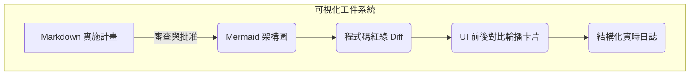

# Agent-First 基礎（下篇）—— 四大工程核心如何落地執行

> **執行完成的那一刻，透明度就是權力。**
>
> 在上一篇中，我們講了「雙階段計畫範式」與「多智能體協同調度」。但光有智能執行還不夠。Antigravity 2.0 的真正威力，在於它如何讓你完全看清整個自動化過程，以及如何確保生成的代碼在真實環境中絕對可用。

---

## 👁️ 第三層：可視化工件系統 (Visual Artifact System)

在 AI 自動化時代，有一個常被忽視的工程痛點：**「黑盒焦慮」**。

當你把代碼庫交給一個實力強大但「看不見摸不著」的 AI 去修改時，你心裡是踏實的還是懸著的？如果它在後台悄悄改了 50 個檔案，然後告訴你「全部搞定了」，你敢直接部署上線嗎？

> [!TIP]
> **在開發流程中，「看得清」（Transparency）往往比「執行正確」（Correctness）更重要。**
> 因為信任是基於理解建立的，而理解來自於可視化。在 Antigravity 2.0 中，可視化就是權力——它讓人類重新掌握對系統的絕對掌控權。

Antigravity 2.0 拋棄了傳統 AI 助手只能在側邊欄進行對話的限制，設計了完整的**可視化工件系統**。



### 📦 核心工件類型與設計哲學

* **Markdown 報告**：人類可讀的、結構化的計畫（`implementation_plan.md`）和結果（`walkthrough.md`），拒絕一切口水話，只用事實和清單說話。
* **Mermaid 圖表**：將複雜的類別關係、資料庫 schema 變更、或者是多智能體協同流向，自動繪製成直觀的 Mermaid 架構圖。
* **Code Diff 區塊**：比 Git Diff 更友好的視覺排版，精確標注修改的行號與邏輯變更，支持一鍵跳轉到編輯器對應位置。
* **前後對比卡片 (Before/After Carousels)**：將 UI 的視覺變更以最直觀的滑塊或卡片形式展示，人類一眼就能看出按鈕有沒有對齊、字體有沒有跑版。
* **實時日誌視圖**：將終端機枯燥的輸出（例如 Webpack 編譯日誌、Jest 測試日誌）進行結構化過濾，只把關鍵報錯或成功指標高亮呈現。

這套系統的設計哲學是：**一個統一的信息儀表板 (Single Pane of Glass)**。
開發者不需要在終端、瀏覽器、編輯器和 Git 工具之間來回登入和切換。Antigravity 2.0 把所有你需要用來做決策的信息，用最優美的視覺排版呈現在同一個工件文件中。你只需審查、核准、看著它執行，流程清爽無比。

---

## 🌐 第四層：瀏覽器端自動化驗證 (Browser-Based Auto-Verification)

後端代碼編譯通過、單元測試 100% 綠燈，這是否意味著用戶在打開網頁時一切正常？

答案是：**完全不一定**。

前端 UI 邏輯的複雜度在今天早已超越了後端。一個簡單的 CSS 樣式微調，可能會導致在 iPhone Safari 上按鈕被遮擋；一個 React 狀態更新的順序錯誤，可能會讓用戶在點擊「提交」時網頁毫無反應。
這些問題，傳統的後端單元測試根本無能為力。如果依靠開發者每次修改後都手動打開瀏覽器、輸入測試帳號、點擊五次去驗證——那麼「自動化」就只是個半吊子。

### 🔄 虛擬瀏覽器的閉環驗證流程

Antigravity 2.0 內建了**瀏覽器端自動化驗證**機制，將前端驗證納入無人介入的閉環中：

```
                       [ 代碼修改完成 ]
                              |
                     [ 啟動本地開發伺服器 ]
                              |
               [ 驅動 Headless 瀏覽器 (Playwright) ]
                              |
              [ 模擬真實用戶操作 (點擊/填表/導航) ]
                              |
                     [ 進行像素級截圖與錄影 ]
                              |
        +---------------------+---------------------+
        |                                           |
 [ 視覺大模型自我驗證 ]                      [ 輸出對比圖與影片 ]
 (檢查排版錯亂/JS錯誤/響應式)                  (寫入 walkthrough.md)
```

1. **自動啟動伺服器**：當 AI 修改完代碼後，它會自動在後台運行 `npm run dev` 或 `yarn start`，監聽本地端口。
2. **模擬用戶操作**：調用內置的 Playwright 虛擬瀏覽器，自動打開 `localhost:3000`，輸入測試資料、點擊登入、跳轉到目標頁面，模擬最真實的用戶旅程（User Journey）。
3. **截圖與錄影**：在關鍵步驟自動截圖，並在整個操作過程中錄製影片。
4. **視覺自我驗證**：AI 會把截圖送入視覺語言模型，自我發問：「按鈕有沒有重疊？」、「文字有沒有超出邊界？」、「網頁控制台（Console）有沒有拋出未捕獲的異常？」。

### 🛡️ 這解決了開發者的哪些痛點？

* **「後端完美，前端爆掉」的慘劇**：再也不會因為修改了一個 API 欄位名稱，導致前端渲染出現 NaN 或是空白頁。
* **響應式設計（Responsive Design）在特定尺寸破裂**：AI 可以命令虛擬瀏覽器切換到 `iPhone 15 Pro`、`iPad Air` 和 `1920x1080` 的解析度，分別截圖並進行視覺比對，自動檢測佈局是否損壞。
* **繁瑣的跨瀏覽器相容性測試**：自動在 Chromium、Firefox 和 WebKit 內核下運行相同的操作路徑，確保跨平台表現一致。

在 Software 3.0 的視角下：**UI 不僅僅是給人看的，它也是代碼的一部分。因此，UI 的驗證也必須完全自動化。**
人類寶貴的時間，應該用來做戰略上的「功能決策」，而不是在瀏覽器裡一遍又一遍地刷新頁面、手動輸入測試密碼。

---

## ⚔️ 第五層：Antigravity 2.0 vs 傳統 AI 助手的決定性差異

為了讓你更直觀地感受這場變革的烈度，我們將 Antigravity 2.0 與以 GitHub Copilot 為代表的傳統 AI 助手進行了全方位的對比：

| 比較維度 | 傳統 AI 助手 (如 Copilot / ChatGPT) | Antigravity 2.0 (Agent-First 執行引擎) |
| :--- | :--- | :--- |
| **交互與運作模式** | **被動式問答**<br>必須由人類引導，一次只回答一個問題或補全一行代碼。 | **主動式代理**<br>接收高維意圖，自主研讀代碼、提案、規劃並執行。 |
| **上下文邊界** | **單一檔案或有限視窗**<br>缺乏對項目全局架構關係與依賴網絡的理解。 | **全局代碼庫 + 即時 Web 檢索**<br>無縫理解百萬行級別項目，並能即時查閱最新文檔。 |
| **系統執行權限** | **僅能生成代碼文字**<br>無法直接修改檔案或運行指令，依賴人類複製貼上。 | **自主讀寫 + 指令執行**<br>在安全沙盒中自主修改多個檔案、編譯並運行終端命令。 |
| **品質驗證機制** | **無自我驗證**<br>寫完代碼即結束，編譯報錯與邏輯漏洞完全由開發者手動排除。 | **閉環自動驗證**<br>自動運行單元測試，並驅動虛擬瀏覽器模擬用戶操作進行視覺檢查。 |
| **多任務協作** | **單一對話線路**<br>無法並行處理任務，遇到複雜重構時推理速度急劇下降。 | **多 Agent 並行調度**<br>調度由「研究、執行、測試」組成的虛擬專家蜂群並行作戰。 |
| **交付與可視化** | **對話框代碼塊**<br>開發者必須逐行看代碼，自行拼湊出系統變更的全局圖像。 | **可視化工件系統**<br>交付精美的實施計畫書、Code Diff、Mermaid 架構圖與 UI 對比。 |

### 🚀 為什麼這些差異會徹底改變遊戲規則？

* **時間成本的驟降**：傳統模式下，完成一個跨越前端、後端、資料庫的重構任務，開發者需要花費數小時進行編寫、編譯、手動測試與除錯。在 Antigravity 2.0 下，這個過程縮短到**分鐘級**。你只需要看計畫、批准、等兩分鐘看 walkthrough 報告。
* **信任度的飛躍**：面對傳統 AI 給出的代碼，開發者總是抱著「懷疑」的心態去仔細閱讀每一行，生怕有隱藏的 bug。而 Antigravity 2.0 帶著「所有測試已通過、瀏覽器渲染無異常、Diff 報告清晰」的**閉環驗證結果**來向你交付，讓懷疑變為踏實的「信心」。
* **複雜度瓶頸的突破**：過去，一個人能管理的代碼庫規模是受人類大腦工作記憶限制的。一旦系統太大，重構的代碼債就讓人「害怕」動手。現在，在虛擬專家軍團的協助下，複雜度不再是障礙，而是發揮創造力的畫布。

---

## 🏁 結尾：你的下一個 24 小時

現在，你已經理解了 Antigravity 2.0 的四大核心層次，也看到了它與傳統 AI 助手的鴻溝。

理論已經完整，架構已經清晰。現在剩下的唯一問題是：**你打算怎麼做？**

這不是一場讓你躺在沙發上觀看的科技秀，這是一場需要你立即披掛上陣的戰役。我們為你整理了在接下來 24 小時內可以立即執行的**「指揮官行動指令」**：

```markdown
- [ ] 1. **重新審視你的代碼庫**：選出一個你目前正在開發、或是想要重構的項目。
- [ ] 2. **定義你的第一個「大膽意圖」**：不要給 AI 寫「幫我寫個 helper 函數」這種小家子氣的任務。寫下一個具體的、有挑戰性的目標（例如：「把這個專案的所有 API 調用加上自動重試機制，並在 UI 上顯示重試狀態」）。
- [ ] 3. **提交給 Antigravity 2.0**：啟動引擎，輸入你的意圖，冷靜地看著它在背景開始 AST 解析與語義探索。
- [ ] 4. **深度審查 implementation_plan.md**：看著它為你整理出的修改檔案清單與潛在風險。在這個階段，體驗你作為一個「架構評審者」而非「打字員」的新身份。
- [ ] 5. **核准並享受閉環驗證**：點擊批准，讓多智能體蜂群在沙盒中並行運作。看著測試一個接一個變綠，最後審閱 walkthrough.md 中的 UI 對比圖。
```

> **預告**
>
> 在下一篇文章《多智能體戰術 —— 如何用蜂群設計實現不可能》中，我們將深入剖析 Antigravity 2.0 的調度細節。我們將以一個真實的「個人時尚助理」項目為案例，向你演示「扇出-扇入（Fan-Out Fan-In）」、「流水線（Pipeline）」以及「樹形決策（Tree Search）」這三大模式在複雜工程中的實戰應用。
>
> 但在讀下一篇之前，先去動手。
>
> **因為自動駕駛的時代，從不等待還在看說明書的人。**

---

*下篇完 · 寫於 2026 年 5 月 26 日*
*從思想到執行，再到決定性對比。Antigravity 2.0 的完整圖景已揭露，現在該是你駕駛的時刻。*

---

👁️ **在 Substack 上追蹤 Antigravity 2.0 完整連載**
🚀 **下周見 —— 從多智能體協同的理論到真實案例**
⚔️ **加入自動駕駛時代的 AI 指揮官陣營**
