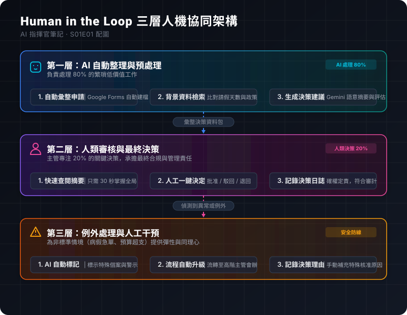

# E01｜為什麼 AI 不該取代你做決定

**《AI 指揮官筆記》Human in the Loop 系列 · S01E01 定錨篇**

---

## 📋 文章規格

| 項目 | 內容 |
|------|------|
| 字數 | 約 2,800 字 |
| 閱讀時間 | 8-10 分鐘 |
| 狀態 | 🚀 正文完成 |

---

## 一、開場：一封來自 HR 主管的求救信

「我每天一睜開眼，面對的就是處理不完的行政雜務：47 封請假郵件、23 張差旅報銷單、15 個關於勞健保政策的員工提問。我知道現在的 AI 很強，我也看過很多自動化工具的展示，但我真的不敢把這些流程交給 AI。我更害怕的是，如果有一天我真的把這一切都自動化了，老闆會不會看著報表對我說：『既然 AI 都能把這些事情做完，那我們公司還需要 HR 部門做什麼？』」

這是一位在中型製造業擔任 HR 主管的讀者寫給我的真實留言。

這封信字裡行間充滿了焦慮，但這種焦慮並非他所獨有。在 2026 年的今天，無論是 HR、財務、行政人員，還是學校的教務處承辦人，幾乎所有每天需要處理大量表單與審批流程的專業工作者，心中都懸著同樣的利劍：**「AI 到底會不會取代我？」**

當我們談論 AI 導入工作流程時，科技巨頭與顧問公司描繪的通常是一幅「全自動化」的科幻未來——無人值守的辦公室、自動流轉的公文、無需人類確認就能完成的審計。然而，這種宣傳越是美好，身處第一線的工作者就越感到恐懼與窒息。工作量確實讓人疲憊不堪，但「被機器取代」的生存危機，卻比工作量本身更令人難以承受。

然而，這個焦慮的根源，真的是因為 AI 太強大嗎？還是因為**我們對 AI 應用模式的想像，被限制在一個過於極端且狹隘的框架裡？**

事實上，我們並不需要在「被雜事淹沒的傳統工作」與「完全被 AI 排除的冰冷自動化」之間做出非黑即白的抉擇。在這兩者之間，存在著第三條路，一條能讓我們既享有 AI 的極致效率，又牢牢掌握決策主導權的道路。

---

## 二、兩種極端的想像

在探索這條新道路之前，我們必須先釐清為什麼現有的兩條舊路行不通。目前大多數企業在思考 AI 流程變革時，往往會陷入以下兩種極端：

### 極端 A：AI 全自動化（無人參與的科幻願景）

這種模式追求「零人介入」（Zero Human Intervention）。其理想的工作流如下：

```
[ 員工提交請假申請 ]
       │
       ▼
[ AI 自動讀取並進行審批 ] （無人類參與）
       │
       ▼
[ 系統自動向員工發送結果 ]
```

聽起來非常美好，對吧？HR 不需要點擊任何按鈕，主管不需要看任何郵件，一切在後台幾毫秒內就處理完畢。但當這種系統真正落地到企業的現實場景時，災難往往隨之而來：

1. **責任歸屬的真空**：AI 本質上是一個基於概率的預測模型。如果 AI 因為解析錯誤，將一位員工因家中緊急變故的「喪假申請」誤判為「曠職拒絕」，導致員工權益受損甚至引發勞資糾紛，這個責任該由誰來承擔？是怪寫代碼的工程師？還是怪 AI 模型本身？在法律與合規層面，AI 不能作為責任主體，最終的法律後果依然必須由人類管理者來承擔。
2. **信任機制的瓦解**：工作不僅僅是冰冷的數據交換，更是人與人之間的關係。當員工知道自己的請假、報銷、績效評估，是由一個冷冰冰的演算法完全決定，而沒有任何一個有血有肉的人看過時，他們對組織的信任度會降到冰點。
3. **缺乏情境彈性**：規章制度是死的，但現實世界是活的。AI 無法理解「情境」。例如，某位員工可能因為突發疾病口頭向主管請假，事後補單時超過了系統規定的時限。傳統上，主管會根據實際人情予以通融；但如果完全交由 AI 審批，系統只會無情地拒絕，這將極大地打擊團隊士氣。

### 極端 B：完全拒絕 AI（效率低下的傳統做法）

因為害怕上述的風險，或者出於對新技術的抗拒，許多企業選擇停留在原地：

```
[ 員工提交請假申請 ]
       │
       ▼
[ HR 手動比對假別餘額與政策 ] （耗時 1-2 天）
       │
       ▼
[ 主管手動查閱、簽名確認 ] （耗時 1-2 天）
       │
       ▼
[ 員工收到最終結果 ] （總計花費 3-5 天）
```

這種做法的優點是安全、合規、責任明確，且充滿了「人情味」。但其代價卻是毀滅性的效率低下：

1. **行政沼澤的吞噬**：HR 與主管的時間被極度瑣碎、重複的「複製-貼上」和「比對數據」所佔據。一個原本只需要 3 分鐘做決定的事情，因為表單流轉、跨部門會辦，往往被拖延成 3 到 5 天。
2. **組織靈敏度的喪失**：當競爭對手已經在用秒級的速度調整策略時，我們的組織還在為了幾張請假單和車資報銷單在公文夾裡旅行。
3. **人才的無謂浪費**：將具有高專業度的人力，浪費在機器最擅長的比對與謄寫工作上，是現代企業管理中最奢侈的浪費。

### 核心洞見

這兩種極端的衝突揭示了一個關鍵事實：**真正的問題從來不是「要不要用 AI」，而是「AI 與人類應該如何分工」。**

全自動化剝奪了人類的決策權與溫度，而完全人工則犧牲了效率。我們需要的，是一個能兼顧「機器的高效整理」與「人類的智慧決策」的折衷設計。這就是我們今天要探討的核心概念——**Human in the Loop（人機協同迴路）**。

---

## 三、第三條路：Human in the Loop

究竟什麼是 **Human in the Loop (HITL)**？

簡單來說，它是一種將人類決策者置於系統核心迴路的設計哲學。在 HITL 的框架下：

> **AI 負責處理 80% 枯燥、重複、格式化的繁瑣工作；而人類則專注於 20% 真正需要判斷力、同理心與責任承擔的關鍵決策。**

這不是簡單的折衷，而是一種經過精密設計的分工架構。我們可以將一個健康的 HITL 系統拆解為三個核心圖層：



```
┌────────────────────────────────────────────────────────┐
│             第一層：AI 自動整理與預處理（80% 工作量）   │
│  - 自動接收申請表單  - 自動查詢歷史數據  - 生成初步審批建議  │
└──────────────────────────┬─────────────────────────────┘
                           │
                           ▼
┌────────────────────────────────────────────────────────┐
│             第二層：人類審核與最終決策（20% 工作量）   │
│  - 主管接收決策資料包  - 閱讀摘要與建議  - 點擊批准/駁回/退回   │
└──────────────────────────┬─────────────────────────────┘
                           │ (遇異常或特殊情境)
                           ▼
┌────────────────────────────────────────────────────────┐
│             第三層：例外處理與人工干預（特殊分支）     │
│  - AI 標記異常數據  - 升級至人工深度會辦  - 記錄例外決策理由   │
└────────────────────────────────────────────────────────┘
```

### 1. 第一層：AI 自動整理與預處理

當員工提交一個申請（例如請假或報銷），AI 會在後台充當一個無形的助理。它會自動做完所有的準備工作：
- 檢查格式是否正確，資訊是否完整。
- 自動從資料庫查詢該員工的剩餘特休天數、歷史請假記錄。
- 根據公司現有的規章制度，生成一份「審批建議草稿」（例如：「該員工申請 3 天特休，查其特休餘額尚有 10 天，且該時段部門無其他同仁請假，符合公司政策，建議予以批准。」）。
- 將上述所有資訊整合成一個精簡的「決策資料包」，發送給主管。

### 2. 第二層：人類審核與最終決策

這是系統中最重要的防線。主管收到決策資料包後，不需要再去翻閱複雜的試算表或比對政策，他只需要花 30 秒瀏覽 AI 已經幫他整理好的摘要與審批建議。

此時，**最終的按鈕必須由人類來點擊**。主管可以選擇「批准」、「駁回」或「退回補充資料」。
- **為什麼這個步驟如此關鍵？** 因為當主管點擊按鈕的那一刻，這個決策的責任就正式歸屬於主管，而非 AI。系統會自動在決策日誌中記錄：`[時間戳記] 主管 A 批准了員工 B 的申請（基於 AI 建議 01）`。這確保了組織內部的責任鏈條（Chain of Responsibility）永遠是清晰且合規的。

### 3. 第三層：例外處理與人工干預

如果 AI 在第一層處理時，發現了不尋常的情況——例如員工申請的是不常出現的「留職停薪」，或者報銷金額異常巨大，又或者 AI 檢測到申請內容語意模糊。

此時，AI 不會盲目做出建議，而是會直接將該案例標記為「異常」（Anomaly），並自動升級流轉通道，將其發送給 HR 專員或高階主管進行深度的人工調查。人類會介入這個特殊的個案，進行訪談、電話溝通，並在系統中手動處理，同時寫下例外批准的具體理由。

---

### 為什麼這樣設計能徹底解決焦慮？

當我們把流程改造成 HITL 架構時，我們會得到以下四個決定性的優勢：

1. **效率的躍升**：主管與 HR 不再需要把時間浪費在打字、轉發郵件和查詢數據上。原本需要幾天流轉的行政流程，被壓縮到主管點擊滑鼠的 30 秒內。
2. **法律與合規的保障**：因為最後的「簽章」是由人類做出的，責任界定非常明確。無論是勞動檢查還是財務審計，系統都能提供完整的人類決策路徑與日誌。
3. **溫度的保留**：員工的特殊需求（如家裡突發狀況）在第三層會被人類溫暖地處理，而不是被演算法無情拒絕。
4. **掌控感的重建**：HR 與主管不再覺得自己「正在被 AI 取代」，相反地，他們會清晰地感受到自己是**「AI 的指揮官」**。

這裡有一個貼切的類比：

> 想像你是一位將軍。你手下有一位極度聰明、效率極高、過目不忘的參謀（AI）。這位參謀幫你收集了戰場上的所有情報，分析了各種可能性，擬定了一份作戰計劃書，並用紅筆標出重點，恭敬地呈遞到你的桌前，對你說：「將軍，這是我的建議，請您過目並簽署。」
>
> 請問，你會因為這位參謀太聰明而感到焦慮，覺得自己被取代了嗎？不會。因為你很清楚，不論參謀擬定了多麼完美的計畫，最後要在作戰命令上簽名、要在歷史上承擔成敗責任的人，依然是你。
>
> **你不是被取代了，你是被賦能了。這就是 Human in the Loop。**

---

## 四、這不是理論，是真實系統

當很多管理書籍和顧問還在宣傳這些哲學概念時，我們已經將這套架構落實為一套可以運作的生產系統。我們稱之為**「新世界 HR 系統」**。

這個系統最迷人的地方在於：**它不需要企業花費數百萬去採購昂貴的企業級套裝軟體，也不需要配置高深的 IT 維護團隊。它是 100% 建立在大家每天都在使用的 Google Workspace 基礎設施之上。**

### 新世界 HR 系統的運作實況

- **申請端**：員工只需要填寫一個簡單的 Google 表單（Google Forms），輸入請假日期與原因。
- **後台處理**：Google Apps Script 會在背景自動觸發，調用 Gemini 模型的 API。AI 會迅速讀取表單內容，進行語意分析（判斷請假原因是否合情合理），並自動查詢背後的 Google 試算表（Google Sheets）以比對該員工的假別餘額。
- **決策呈遞**：AI 自動生成一封格式精美的電子郵件發送給主管。信中包含了 AI 整理的摘要以及「一鍵審批」的動態連結。
- **人類決定**：主管在手機上點開 Gmail，看一眼摘要，點擊「批准」。整個流程從員工送出表單到主管完成審批，耗時通常不超過 5 分鐘。

### 致謝與致敬

這套系統的設計理念，並非憑空誕生。在此我們要特別致謝台灣的教育工作者**彭智標老師**。

彭老師在學校的行政場景中，面對繁重的公文與活动申報流程，率先探索並實踐了以 Google Workspace 為核心的行政工作流自動化專案。他用實際行動證明了：透過巧妙的腳本設計與人機分工，即使是預算極其有限的學校單位，也能建立起不亞於跨國企業的智慧行政系統。

我們借鑑了彭老師專案中的核心精髓——**「低成本、不造輪子、專注於工作流串聯」**，並將其升級移植到企業的 HR 業務場景中，結合了最新的大語言模型（LLM）能力，最終打磨出了這套「新世界 HR 系統」。

目前，這套系統的完整原始碼與設計文檔已經完全開源在 GitHub 上（https://github.com/pppeee861005/gws-hr-automation）。我們承諾，這不是一個只存在於 PPT 上的概念，而是一個任何人都可以複製、修改並部署在自己公司裡的實用工具。

---

## 五、收尾：回到那封求救信

讓我們回到那位 HR 主管的問題：「AI 會取代我嗎？」

我們的答案非常明確：**「AI 不會取代 HR，但使用 AI 的 HR，將會取代不使用 AI 的 HR。」**

當你學會將自己從繁瑣的表單整理、數據謄寫中解放出來，將這些 80% 的雜事交給 Google Workspace 與 Gemini 時，你才真正有時間去關注那 20% 真正需要你專業價值的地方：
- 去規劃更有吸引力的員工福利與激勵政策。
- 去傾聽同仁在工作上遇到的瓶頸，進行溫暖的人性關懷。
- 去協助老闆進行組織架構的優化與人才戰略布局。

這些需要深刻同理心、人際溝通與戰略眼光的決策，是任何大語言模型在可預見的未來都無法替代的。

### 下一步，讓我們動手實作

這是 《AI 指揮官筆記》Human in the Loop 系列的第一篇。在接下來的文章中，我們不會再跟你聊空泛的理論，而是會直接帶你進入實戰戰場。

在下一篇 **S01E02** 中，我們將會以最常見的**「員工請假審批流程」**為例，手把手教你如何使用 Google Forms、Sheets、Apps Script 以及 Gemini API，親手搭建出屬於你自己的「人機協同審批系統」。

我們會為你提供：
1. **完整的 Apps Script 程式碼**（複製貼上即可使用）。
2. **Google 表單與試算表的配置模板**。
3. **與 Gemini API 接接的配置指南**。

你會親眼見證，一個原本需要 3 到 5 天、讓人抓狂的行政流程，是如何在 5 分鐘內，優雅且安全地完成的。

請記住：**AI 不是來搶走你的方向盤的，它是你的導航儀。最後決定往哪裡開的，永遠是手握方向盤的你。**

我們下一篇實戰篇見。

---

## 🏷️ 本篇知識卡片（用於社群推廣）

1. **核心信念**：AI 負責 80% 的繁瑣，人類專注 20% 的決策。這不是妥協，而是人機協同的最佳設計。
2. **指揮官思維**：不要問 AI 會不會取代你，要問你如何把 AI 當成你的「超級特助」，讓它幫你整理情報，而由你做出最終簽署。
3. **低成本創新**：新世界 HR 系統證明了，利用現有的 Google Workspace 基礎設施，不造輪子，也能低成本搭建出強大的企業 AI 流程。
