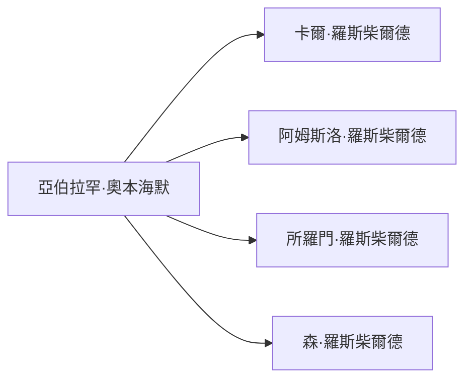

# 今日閱讀 – 《國際銀行家》人物筆記（2026-05-24）

## 人物概覽

### 亞伯拉罕·奧本海默 (abraham_oppenheimer.md)

亞伯拉罕·奧本海默（Abraham Oppenheimer），於 1834 年與夏洛特（Charlotte）結婚，成為科隆奧本海默家族的重要成員。

- **關係**：岳父卡爾·羅斯柴爾德、叔叔阿姆斯洛·羅斯柴爾德、所羅門·羅斯柴爾德、森·羅斯柴爾德等。

---

### Rothschild 家族 (rothschild_family.md)

此文件為家族的簡要說明佔位符，未來可補充詳細資訊。

---

*以下為目錄中其餘人物筆記的檔名列表（可在後續自行展開）*:

- amstlo_paris_conquest.md
- baron_family.md
- gerson.md
- mundelsong_family.md
- old_breischroeder.md
- old_breischroeder_agent.md
- oppenheimer_family_of_cologne_breslau.md
- readme.md
- rothschild_family_original.md
- schroder_family.md
- segelman_family_wall_street_banker_from_bavaria.md
- sief_family.md
- speller_family.md
- when.md
- who.md
- who_are_they.md
- why_imporoant.md
- woberge_family_of_hamburg.md
- “鐵血宰相”俾斯麥的心腹摩林銀行家 (Molin banker, confidant of Otto von Bismarck).md

## Mermaid 圖表建議

*此圖示關係圖僅為示範，後續可依需求擴充至完整人物關係網絡。*

在這個過程中。銀行家一方面製造問題，一方面解決問題。
他們為戰爭供：從軍火公司上市，發行軍火債券，運轉融資。到國家戰爭債券發行，戰後的賠款債券承銷，國家重建融資，等業務的戰爭綜合解決方案。
在戰爭中，政府是不計代價的，正是銀行家收購國有資產的良機。無論戰爭結果，兩邊的銀行家都賺錢
