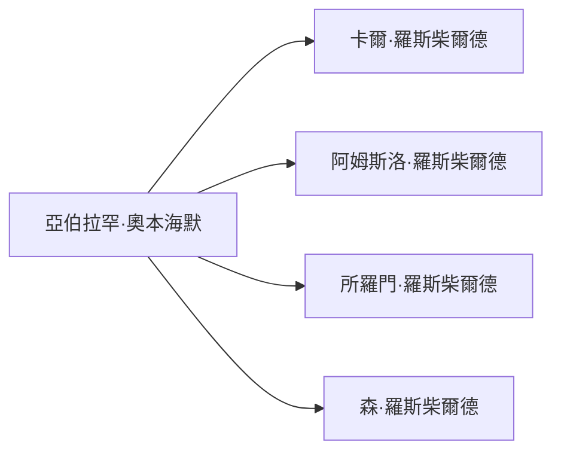

# 2026‑05‑24 閱讀筆記整理

## 人物概覽
- **亞伯拉罕·奧本海默 (Abraham Oppenheimer)** – 1834 年與夏洛特結婚，屬科隆奧本海默家族。\
  - 主要關係：岳父 **卡爾·羅斯柴爾德**，叔叔 **阿姆斯洛·羅斯柴爾德**、**所羅門·羅斯柴爾德**、**森·羅斯柴爾德** 等。
- **Rothschild 家族** – 佔位符，待補充詳細資訊。
- **俾斯麥 (Otto von Bismarck)** – 德意志帝國奠基者、外交與內政主導者。
- **威廉一世 (Kaiser Wilhelm I)** – 德意志帝國首位皇帝（1871‑1888），授權俾斯麥實施「鐵血政策」。

## 事件：1870 年普法戰爭
- **戰爭結果**：法國慘敗，拿破崙率領約 10 萬大軍投降。
- **巴黎工人起義**：戰後爆發，推翻拿破崙三世統治，導致法國政治體制變革。
- **德意志帝國成立**：戰爭直接促成 1871 年德意志帝國的統一與成立。

## 金融與賠款影響
- **賠款金額**：德國向法國徵收 **50 億法郎** 的戰爭賠款，最終全部完成。
- **銀行家角色**：此賠款成為「銀行家的大餅」——銀行家提供資金、發行債券，從軍火、戰爭債券到戰後重建融資全程參與，兩邊的銀行家皆獲利。
- **清朝對比**：清朝賠款多以稅賦形式直接壓在百姓身上；西方則透過發行債券讓富人投資，展示了現代金融的集資能力。

## Mermaid 圖表建議

*圖示可擴充至完整人物關係網絡。*

## 小結
- 銀行家在戰爭與賠款中扮演關鍵的資金供應與風險承擔角色，形成「大餅」分配。
- 俾斯麥與威廉一世的合作是德國統一與帝國化的核心推手。
- 1870 年普法戰爭不僅改變歐洲權力格局，也展示了金融工具在國家利益中的運用方式。
