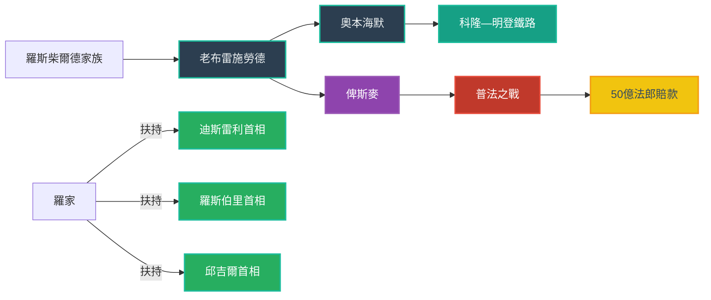

# 第一章人脈關系圖

以下是《貨幣戰爭二：金權天下》第一章中的主要人物與關係，使用 Mermaid flowchart 表示，可直接在 `build.py` 產生的網頁中渲染。

> **說明**：
> - **羅斯柴爾德家族** 為國際銀行核心勢力，透過 **老布雷施勞德** 在德國運作。
> - **老布雷施勞德** 同時是 **奧本海默**（科隆金融霸主）與 **俾斯麥**（德國鐵血宰相）的私人銀行家。
> - **科隆—明登鐵路** 代表當時重要的基礎建設投資，與奧本海默資金密切相關。
> - **普法之戰** 以及隨後的 **50億法郎賠款** 展示了金融資本與戰爭財政的緊密結合。

節點國家：
1.迪斯雷利首相，羅斯伯里首相，邱吉爾首相。三個人同一節點，英國
2.羅斯柴爾德，英國
3.厄蘭路，法國
4.貝列拉，法國
5.俾斯麥，德國
6.布雷斯勞德，德國
a.普丹戰爭
b.鐵路私有化

關系邊：
2→1 扶持 
3→2 背叛的門徒
3-4 合作
2→5 扶持
6→5 融資
5-a-6
5-b-6
2→6 情報，代理

